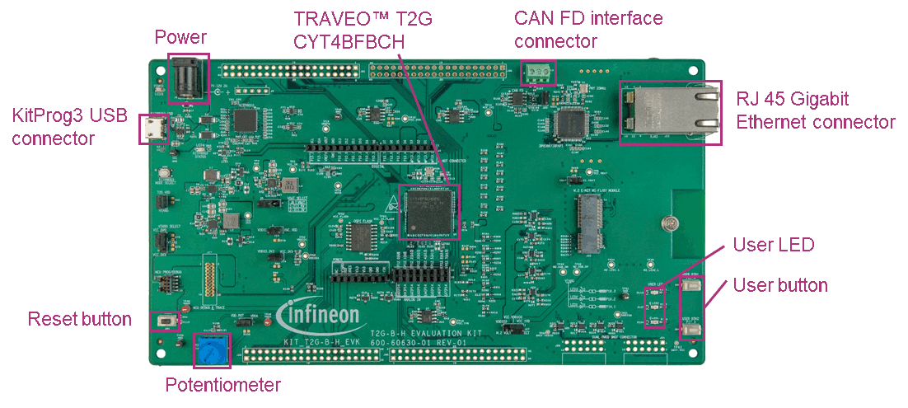

# SAR ADC Various Processing of Conversion Results
**This code example shows how the conversion results of the SAR ADC change depending on the various conversion output methods.** 

## Device
The device used in this code example (CE) is:
- [TRAVEO™ T2G CYT4BF Series](https://www.infineon.com/cms/en/product/microcontroller/32-bit-traveo-t2g-arm-cortex-microcontroller/32-bit-traveo-t2g-arm-cortex-for-body/traveo-t2g-cyt4bf-series/)

## Board
The board used for testing is:
- TRAVEO™ T2G evaluation kit ([KIT_T2G-B-H_EVK](https://www.infineon.com/cms/en/product/evaluation-boards/kit_t2g-b-h_evk/), [KIT_T2G-B-H_LITE](https://www.infineon.com/cms/en/product/evaluation-boards/kit_t2g-b-h_lite/))

## Scope of work
In this example, the results of various ADC conversion output methods (Averaging, Alignment, Sign Extension) are executed. The KIT potentiometer is set as the ADC input and the conversion is performed. The results are sent to the terminal each time according to the user's input, which includes the average count and the output format.

## Introduction

**SAR ADC**  

TRAVEO™ T2G features a Successive Approximation Register Analog-to-Digital converter (SAR ADC), The SAR ADC is
designed for applications that require a moderate resolution and high data rate. It consists of the following blocks:

- SARADC Core

- SARMUX

- SAR sequencer

- Diagnostic reference

- Reference buffer

SARMUX is an analog multiplexer to connect the signal sources to the ADC input; SARADC core then performs
analog-to-digital conversion. A SAR sequencer is responsible for prioritizing the triggers requests, enable the appropriate analog channel, and control the sampling.A single-ended SAR ADC system is capable of scanning up to 40 analog inputs (32 GPIOs and eight internal signals).

More details can be found in [Technical Reference Manual (TRM)](https://www.infineon.com/dgdl/?fileId=5546d4627600a6bc017600bfae720007), [Registers TRM](https://www.infineon.com/dgdl/?fileId=5546d4627600a6bc017600be2aef0004) and [Data Sheet](https://www.infineon.com/dgdl/?fileId=5546d46275b79adb0175dc8387f93228).

## Hardware setup
This CE has been developed for:
- TRAVEO™ T2G evaluation kit ([KIT_T2G-B-H_EVK](https://www.infineon.com/cms/en/product/evaluation-boards/kit_t2g-b-h_evk/)) 
 

- TRAVEO™ T2G Body High Lite evaluation kit ([KIT_T2G-B-H_LITE](https://www.infineon.com/cms/en/product/evaluation-boards/kit_t2g-b-h_lite/)) 
 
  
The example uses the default configuration of the board. Refer to the kit user guide to verify that the board is properly configured.

## Implementation

**SAR ADC Configurations**

In this example of code, A/D conversion is implemented with PDL(Peripheral Driver Library) APIs in *configure_SAR_ADC()*.

- <a href="https://infineon.github.io/mtb-pdl-cat1/pdl_api_reference_manual/html/group__group__sar2__functions.html#gad6ddc69b82b06fda5952c5da00de35ed"><i>Cy_SAR2_Init()</i></a> to initialize the ADC module and set the reference buffer with band gap voltage. The configurations are included in the structure *CE_SAR2_config* which is configured using Device Configurator: 
 
- Note that the clock settings for A/D conversion are done in Device Configurator as well, and are reflected automatically in *cybsp_init()* call in advance
- Then <a href="https://infineon.github.io/mtb-pdl-cat1/pdl_api_reference_manual/html/group__group__sar2__functions.html#gab2725bd7acf6658c561a1a4614c12c5d"><i>Cy_SAR2_SetReferenceBufferMode()</i></a> sets ePASS MMIO reference buffer mode
- After initializing channels, set the interrupt to occur at the end of the last channel conversion. <a href="https://infineon.github.io/mtb-pdl-cat1/pdl_api_reference_manual/html/group__group__sar2__functions.html#gaec97a2bde0497f5e95deb60a5e9d081a"><i>Cy_SAR2_Channel_SetInterruptMask()</i></a> is called to use the interrupt factor *CY_SAR2_INT_GRP_DONE* and the interrupt handler *handle_SAR_ADC_IRQ()* is registered by <a href="https://infineon.github.io/mtb-pdl-cat1/pdl_api_reference_manual/html/group__group__sysint__functions.html#gab2ff6820a898e9af3f780000054eea5d"><i>Cy_SysInt_Init()</i></a>. Finally, calling *NVIC_SetPriority()* and *NVIC_EnableIRQ()* to enable the interrupt
- The A/D convertion is triggered by the software by calling <a href="https://infineon.github.io/mtb-pdl-cat1/pdl_api_reference_manual/html/group__group__sar2__functions.html#ga07a7023e4f6db655204d25a21b036651"><i>Cy_SAR2_Channel_SoftwareTrigger()</i></a>

The interruption generated when the conversion of the two channels terminates is managed by *handle_SAR_ADC_IRQ()*.

- Firstly, the function obtains the conversion status via the <a href="https://infineon.github.io/mtb-pdl-cat1/pdl_api_reference_manual/html/group__group__sar2__functions.html#gae07d8e288f6863cef7e8fa37fa2c0f55"><i>Cy_SAR2_Channel_GetInterruptStatus()</i></a> API. Then it clears the interrupt flags by <a href="https://infineon.github.io/mtb-pdl-cat1/pdl_api_reference_manual/html/group__group__sar2__functions.html#ga3038fbd14b4fef98a91a8713c559472d"><i> Cy_SAR2_Channel_ClearInterrupt()</i></a>
- This function specifies how the conversion results must be processed based on the different output formats in the current configuration. According to the calculations, it shows the value of the raw conversion result and the voltage value on the terminal
- In addition to the above, it reflects the new configuration specified by the user and the new configuration is performed by calling the *configure_SAR_ADC()* feature

Please refer [here](https://infineon.github.io/mtb-pdl-cat1/pdl_api_reference_manual/html/group__group__sar2.html) for detailed explanation of PDL API usage for SAR ADC.

**Miscellaneous settings**  

- **STDIN / STDOUT setting**

  - Calling <a href="https://infineon.github.io/retarget-io/html/group__group__board__libs.html#ga21265301bf6e9239845227c2aead9293"><i>cy_retarget_io_init()</i></a> function to use UART as STDIN / STDOUT
    - Initialize the port defined as *CYBSP_DEBUG_UART_TX* as UART TX and *CYBSP_DEBUG_UART_RX* as UART RX (these pins are connected to KitProg3 COM port)
    - The serial port parameters are 8N1 and 115200 baudrate

  - <a href="https://infineon.github.io/mtb-hal-cat1/html/group__group__hal__uart.html#ga89108b2d339dc9863ec660588e3a4a12"><i>cyhal_uart_getc()</i></a> returns the user input from the terminal as received data

## Run and Test
For this example, a terminal emulator is required to display outputs and receive keys pressed. You can install a terminal emulator if you do not have one. In this example, [Tera Term](https://ttssh2.osdn.jp/index.html.en) was used as the terminal emulator.

After code compilation, perform the following steps to flash the device:
1. Connect the board to your PC using the provided USB cable through the KitProg3 USB connector
2. Open a terminal program and select the KitProg3 COM port. Set the serial port parameters to 8N1 and 115200 baud
3. Program the board using one of the following:
    - Select the code example project in the Project Explorer
    - In the **Quick Panel**, scroll down, and click **[Project Name] Program (KitProg3_MiniProg4)**
4. After programming, the code example starts automatically
5. Specify the output format and average count by pressing corresponded key as shown in below figure
    **Figure: Terminal Output** 
    
6. Rotate the potentiometer to change the ADC input voltage. Based on user input, the results will be displayed in the terminal window
7. You can debug the example to step through the code. In the IDE, use the **[Project Name] Debug (KitProg3_MiniProg4)** configuration in the **Quick Panel**. For details, see the "Program and debug" section in the [Eclipse IDE for ModusToolbox™ software user guide](https://www.infineon.com/dgdl/?fileId=8ac78c8c8386267f0183a8d7043b58ee)

**Note:** **(Only while debugging)** On the CM7 CPU, some code in *main()* may execute before the debugger halts at the beginning of *main()*. This means that some code executes twice: once before the debugger stops execution, and again after the debugger resets the program counter to the beginning of *main()*. See [KBA231071](https://community.infineon.com/t5/Knowledge-Base-Articles/PSoC-6-MCU-Code-in-main-executes-before-the-debugger-halts-at-the-first-line-of/ta-p/253856) to learn about this and for the workaround.

## References  
Relevant Application notes are:
- AN235305 - GETTING STARTED WITH TRAVEO™ T2G FAMILY MCUS IN MODUSTOOLBOX™
- [AN219755](https://www.infineon.com/dgdl/?fileId=8ac78c8c7cdc391c017d0d3aaebf676a) - Using a SAR ADC in TRAVEO™ T2G automotive microcontrollers

ModusToolbox™ is available online:
- <https://www.infineon.com/modustoolbox>

Associated TRAVEO™ T2G MCUs can be found on:
- <https://www.infineon.com/cms/en/product/microcontroller/32-bit-traveo-t2g-arm-cortex-microcontroller/>

More code examples can be found on the GIT repository:
- [TRAVEO™ T2G Code examples](https://github.com/orgs/Infineon/repositories?q=mtb-t2g-&type=all&language=&sort=)

For additional trainings, visit our webpage:  
- [TRAVEO™ T2G trainings](https://www.infineon.com/cms/en/product/microcontroller/32-bit-traveo-t2g-arm-cortex-microcontroller/32-bit-traveo-t2g-arm-cortex-for-body/traveo-t2g-cyt4bf-series/#!trainings)

For questions and support, use the TRAVEO™ T2G Forum:  
- <https://community.infineon.com/t5/TRAVEO-T2G/bd-p/TraveoII>
